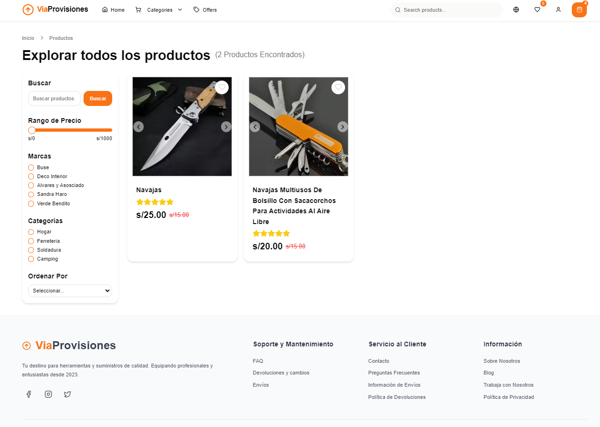

# Via Provisiones - Your Premium Food Market



## About Via Provisiones

Welcome to Via Provisiones, your premier online destination for high-quality food products and provisions. Our e-commerce platform brings together the finest selection of artisanal foods, fresh produce, and gourmet ingredients right to your doorstep.

### 🌟 Key Features

- **Curated Selection**: Carefully selected premium food products
- **User-Friendly Shopping**: Intuitive interface for seamless shopping experience
- **Secure Checkout**: Protected payment processing
- **Real-Time Inventory**: Live stock updates
- **Responsive Design**: Perfect shopping experience on any device

## Tech Stack

This project is built with cutting-edge technologies:

- Next.js 15
- React
- TypeScript
- Shadcn
- Tailwind CSS
- Axios
- MongoDb

## Getting Started

First, run the development server:

```bash
npm run dev
# or
yarn dev
# or
pnpm dev
# or
bun dev
```

Open [http://localhost:3000](http://localhost:3000) with your browser to see the result.

## Learn More

To learn more about the technologies used in this project:

- [Next.js Documentation](https://nextjs.org/docs)
- [React Documentation](https://reactjs.org/)
- [Tailwind CSS](https://tailwindcss.com/)

## Deploy on Vercel

Deploy your own version of Via Provisiones using [Vercel](https://vercel.com/new?utm_medium=default-template&filter=next.js).

## License

This project is licensed under the MIT License - see the LICENSE.md file for details.